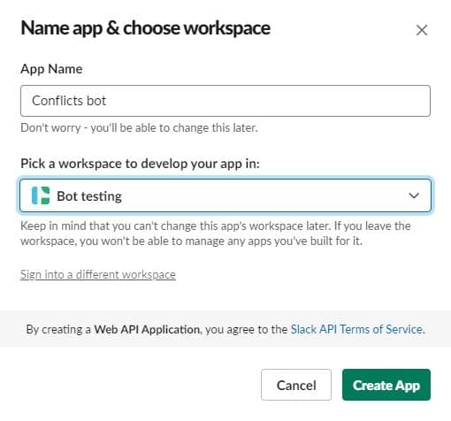
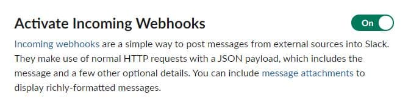
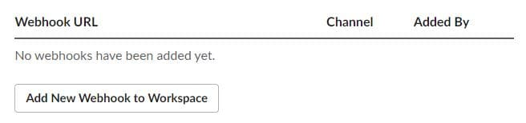
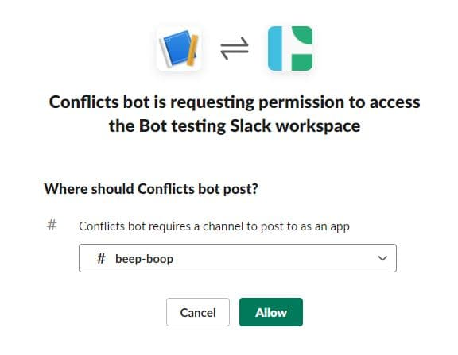

# Git conflict Slack bot 🤖

Notify a Slack channel about git merge conflicts. This could be helpful to run automatically on long-lived development branches.

## Install

Clone the repository and make the script executable:

```bash
git clone git@github.com:nickFalcone/git-conflict-bot.git
cd git-conflict-bot/
chmod +x conflicts.sh
```

## Set up Slack

Set up a Slack account and [create a new app](https://api.slack.com/apps/new) __from scratch__.

Configure the __name__ and __workspace__, then Create App.



Select __incoming webhooks__


Be sure to activate incoming webhooks


Click __Add New Webhook to Workspace__



Confirm the bot name and the Slack channel the bot will post in. Then click __Allow__.



Copy the newly created Webhook URL to clipboard. Do not add it to files that will be tracked by git.


## Endpoint

Create the `endpoint.txt` file with the following command using your copied Webhook URL. This file will not be tracked by git.

```bash
echo -e "https://hooks.slack.com/services/your/hook/here" >> endpoint.txt
```

## Set repository path

Modify the `repo_path` variable to match the repository you want to check.

```bash
repo_path=~/projects/conflicted-repo/
```

## Run

```bash
./conflicts.sh -i development -d main
```
`-i` incoming branch, required
`-d` destination branch, required

## Results

The bot will report any conflicted files from the merge.


## Automate

The script can run at scheduled intervals with [crontab](https://man7.org/linux/man-pages/man5/crontab.5.html) or [Mac Automator](https://support.apple.com/en-gb/guide/automator/autbbd4cc11c/mac).
