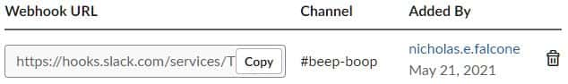
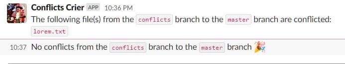

# Git conflict Slack bot

Notify a Slack channel about git merge conflicts. This could be helpful to run automatically on long-lived development branches, or as a post-merge webhook.

## Install

Clone the repository and make the script executable:

```bash
git clone git@github.com:nickFalcone/git-conflict-bot.git
cd git-conflict-bot/
chmod +x conflicts.sh
```

## Set up Slack

Set up a Slack account and [create a new app](https://api.slack.com/apps/new). Select __Incoming Webhooks__:


Click __Add New Webhook to Team__


Confirm the bot name and the Slack channel the bot will post in. Then click __Authorize__.

Copy the newly created Webhook URL to clipboard. Do not add it to files that will be tracked by git.



Create the `endpoint.txt` file using your Webhook URL. This file will not be tracked by git.

```bash
echo -e "https://hooks.slack.com/services/your/hook/here" >> endpoint.txt
```

## Modify

Modify the following variables in `conflicts.sh` based on your own situation:

```bash
repo_path=~/projects/conflicted-repo/

dest_branch=master

incoming_branch=conflicts
```

## Run

```bash
./conflicts.sh
```

## Results

The bot will report any conflicted files from the merge.



## Automate

The script can run at scheduled intervals with [crontab](https://man7.org/linux/man-pages/man5/crontab.5.html) or [Mac Automator](https://support.apple.com/en-gb/guide/automator/autbbd4cc11c/mac).
